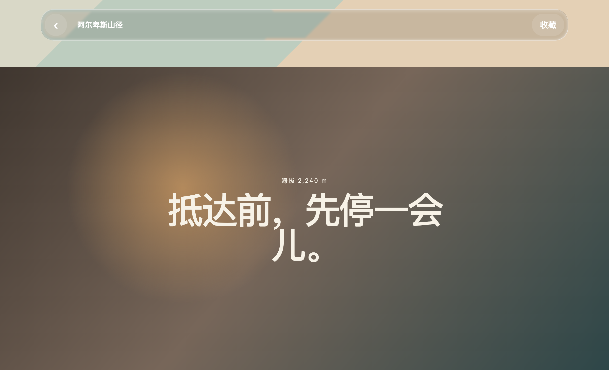
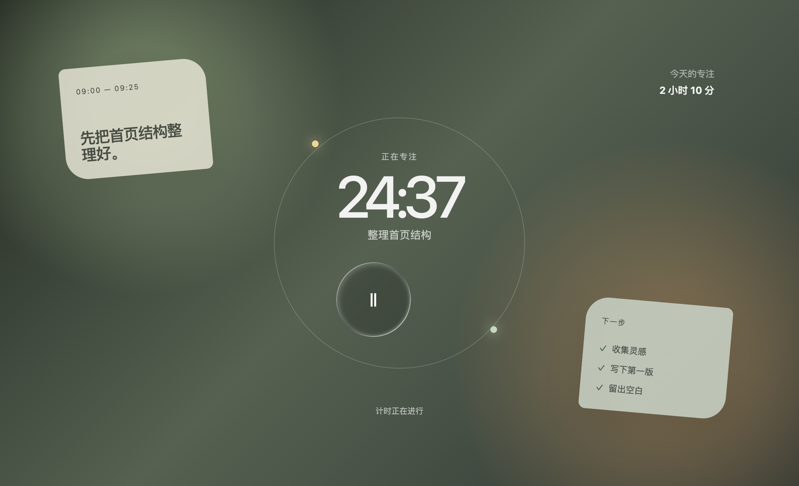
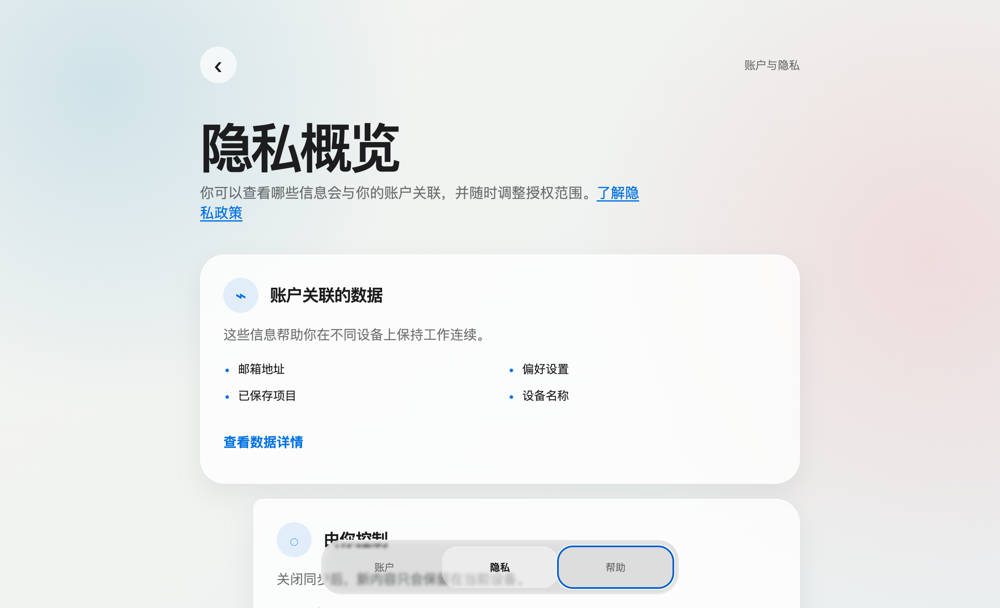

# Apple Liquid Glass

Apple Liquid Glass 是一个面向 Web 界面的设计与实现 Skill：

> 先用 Apple HIG 的设计思想规划页面，再用固定的四层 SVG 液态玻璃方案实现材质。

它不是普通的 glassmorphism，也不是一套可以随意替换的玻璃滤镜。它的目标是让页面同时具备清晰的产品目的、自然的交互行为和稳定一致的液态玻璃视觉语言。

## 核心理念

Apple Liquid Glass 将界面设计拆成两层：

```text
设计层：目的、层级、视觉方向、交互、动效、排版、无障碍
        ↓
材质层：SVG 位移 + 四层液态玻璃结构
```

### 设计层

设计阶段将 Apple HIG 转译为可执行的 Web 决策：

- 明确页面的一个核心目的
- 建立清晰的内容层级和常用路径
- 选择统一的视觉方向与记忆点
- 让控件在按下时立即响应
- 让拖拽和手势保持 1:1 跟随
- 让动效可以被打断，并继承释放速度
- 保持进入、退出和触发源之间的空间连续性
- 使用系统字体、合理的 tracking 和 leading
- 处理 reduced motion、reduced transparency、high contrast、键盘焦点和触控区域
- 用语义颜色、熟悉的控件与明确的恢复路径取代装饰性氛围

### 材质层

所有玻璃表面必须使用以下四层：

| 层级 | 作用 |
| --- | --- |
| `liquid_glass-outer` | SVG 背景位移与边缘折射 |
| `liquid_glass-cover` | `rgba(0, 0, 0, .12)` 与 `blur(2px)` |
| `liquid_glass-sharp` | 清晰的边缘高光 |
| `liquid_glass-reflect` | 内部反射、厚度和暗部阴影 |

内容位于 `z-index: 4`，不能被折射层覆盖。

## 标准结构

```html
<svg style="display: none" aria-hidden="true">
  <defs>
    <filter id="liquid_glass_filter" x="0%" y="0%" width="100%" height="100%" filterUnits="objectBoundingBox">
      <feDisplacementMap scale="200" />
    </filter>
  </defs>
</svg>

<div class="liquid_glass-wrapper" style="--border-radius: 26px">
  <div class="liquid_glass-outer"></div>
  <div class="liquid_glass-cover"></div>
  <div class="liquid_glass-sharp"></div>
  <div class="liquid_glass-reflect"></div>

  <div class="liquid_glass-content">
    <!-- 页面内容 -->
  </div>
</div>
```

背景必须具有可见的空间细节，例如图片、渐变场、轮廓线、色块或纹理。没有背景变化，就无法观察到边缘折射。

## 三个场景案例

三份案例共用同一套 SVG filter 与四层材质，但不复用同一种页面构图或控件形状。

| 场景 | 重点 | 运行文件 |
| --- | --- | --- |
| 山野导览 | 照片内容层上的粘性横向工具栏；滚动时透过玻璃观察场景变化 | [01-trail-guide.html](examples/01-trail-guide.html) |
| 专注计时 | 以圆形玻璃控制器组织一次明确的开始／暂停任务；便签和轨道构成非卡片式背景 | [02-focus-session.html](examples/02-focus-session.html) |
| 隐私概览 | 标准信息分组与底部共享玻璃导航分层；强调可读性、解释与恢复路径 | [03-privacy-overview.html](examples/03-privacy-overview.html) |

在本地 HTTP 服务中打开这些文件。它们是可交互的视觉案例，不接入真实账户、定位、支付或系统权限。

| 山野导览 | 专注计时 | 隐私概览 |
| --- | --- | --- |
|  |  |  |

## 使用流程

1. 使用 `$apple-liquid-glass`，并阅读 [SKILL.md](./SKILL.md)。
2. 先完成设计 brief：目的、视觉方向、层级、材质分布、交互状态、动效和无障碍。
3. 再创建背景和页面内容。
4. 使用标准 SVG filter 和四层玻璃结构。
5. 先展示一个高保真预览取得确认，再扩展完整页面；在真实浏览器中检查桌面端、移动端、fallback 和控制台错误。

## 验证

```bash
python3 scripts/validate_skill.py .
python3 scripts/extract_html_example.py \
  --source references/vanilla-example.md \
  --output /tmp/apple-liquid-glass/index.html
```

浏览器验收至少确认：

- 每个 wrapper 都包含四个玻璃层
- 存在 `#liquid_glass_filter`
- `liquid_glass-outer` 使用 `url(#liquid_glass_filter)`
- cover 使用 `blur(2px)`
- 内容保持在 `z-index: 4`
- 设计目的、信息层级、交互状态和无障碍策略清晰
- SVG filter 不可用时页面仍然可读、可操作

## 文件结构

```text
SKILL.md                         主 Skill 规范
agents/openai.yaml               Skill 调用提示
references/vanilla-example.md   可运行的四层液态玻璃 fixture
references/apple-hig.md         Apple HIG 视觉语法与案例解读
references/hig-foundations.md   色彩、排版、图标与无障碍基础
references/hig-patterns.md      登录、表单、恢复与其他任务流
references/hig-components-inputs.md  控件、输入与多端操作规则
references/hig-technologies.md  能力与敏感数据边界
references/verification.md      设计与材质验收清单
examples/shared.css             三个案例共享的固定四层材质与 fallback
examples/01-trail-guide.html   山野导览案例
examples/02-focus-session.html 专注计时案例
examples/03-privacy-overview.html 隐私概览案例
scripts/validate_skill.py       Skill 静态校验
scripts/extract_html_example.py 提取 HTML fixture
```

## 许可与来源

本 Skill 的液态玻璃实现方案基于公开的 [shuding/liquid-glass](https://github.com/shuding/liquid-glass) 代码思路整理；Apple HIG 的设计原则被转译为 Web 页面设计与交互决策规则。它不复制 Apple 的截图、资产或商标，也不声称网页等同于原生 Apple 界面。
