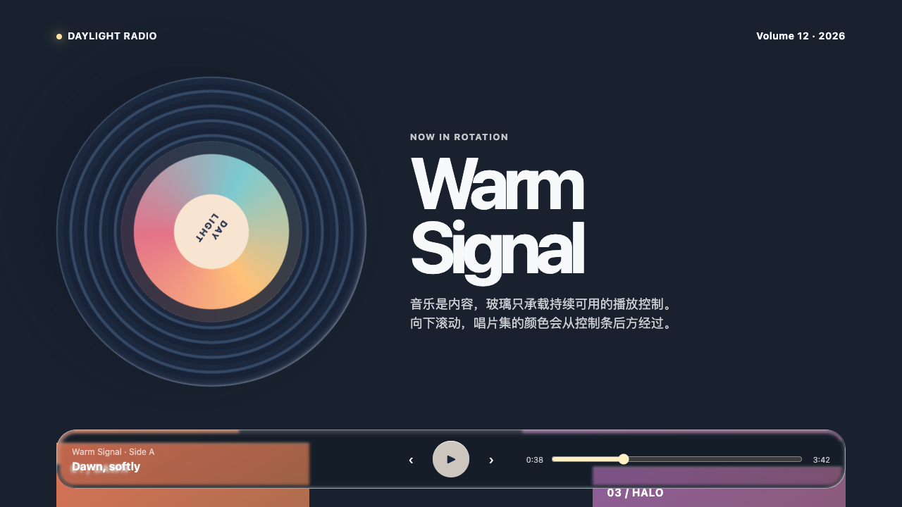
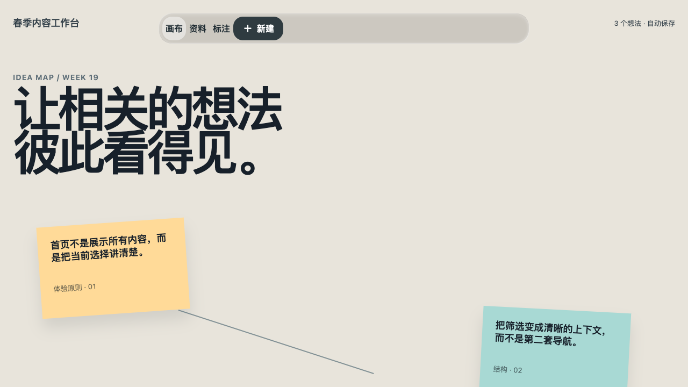
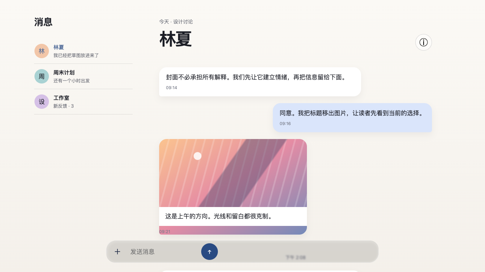

# Apple Liquid Glass

一个让 Codex 设计并实现 Apple 风格 Web 页面的 Skill。

> Apple HIG 决定页面为什么这样设计；Liquid Glass 结构决定材质怎样真实地工作。

它不是“给所有卡片加模糊”的 glassmorphism：Apple HIG 用来判断页面目的、控件分组与颜色语义；固定 SVG 四层结构只实现真正浮在内容之上的功能控件。

## 30 秒快速使用

### 1. 安装到 Codex

首次安装：

```bash
mkdir -p ~/.codex/skills
git clone https://github.com/distancewk/apple-liquid-glass.git ~/.codex/skills/apple-liquid-glass
```

已经安装过时更新：

```bash
cd ~/.codex/skills/apple-liquid-glass
git pull
```

安装或更新后，新建一个 Codex 任务，让它重新发现 Skill。

### 2. 直接发出设计请求

```text
使用 $apple-liquid-glass 设计一个旅行规划页面。
先完成一个可交互的高保真预览；我要确认液态玻璃效果后，再扩展完整页面。
```

Skill 会先交付一个代表性切片，而不是一次生成整页：背景应透过玻璃变化，控件应有真实按下/焦点状态，并在确认后再扩展内容。

### 3. 运行仓库中的案例

```bash
cd ~/.codex/skills/apple-liquid-glass
python3 -m http.server 4173
```

然后打开 `http://localhost:4173/examples/04-music-player.html`。另外两个主案例分别是 `05-workbench.html` 和 `06-chat.html`。

## 它适合做什么

- 需要 Apple 式克制、清晰层级和自然交互的 Web 页面
- 工具栏、底部导航、浮动操作、媒体导览等需要透出背景的功能控件
- 登录、设置、隐私说明、搜索、表单、内容浏览等需要完整体验规则的页面

不适用于把每个内容卡片、输入框和按钮都做成玻璃，或把 Apple 的截图、资产、商标直接复制到网页中。

## 三个案例，一种材质合同

| 案例 | 验证重点 | 直接打开 |
| --- | --- | --- |
| 音乐播放 | 沉浸式封面背景与底部播放控制 | [运行](examples/04-music-player.html) |
| 创意工作台 | 自由画布、便签与顶部共享工具栏 | [运行](examples/05-workbench.html) |
| 团队聊天 | 滚动消息流与底部悬浮输入器 | [运行](examples/06-chat.html) |

## 工作原理

```text
用户任务与产品约束
        ↓
页面 brief
目的 · 内容层级 · 场景 · 颜色语义 · 无障碍
        ↓
Apple HIG 路由
Foundations · Patterns · Components / Inputs · Technologies
        ↓
控件拓扑
独立动作 / 独立同行动作 / 共享命令组
        ↓
三层视觉平面
内容平面 → 标准信息分组 → Liquid Glass 功能控件
        ↓
固定材质渲染器
SVG 位移滤镜 + 四层玻璃 + 匹配形状遮罩
        ↓
浏览器验证
滚动透景 · 交互状态 · fallback · 可访问性 · Apple 一致性审查
```

### 1. 先决定控件关系，再决定圆角

圆角不是装饰 token，而是表达控件关系的几何语言：

| 关系 | 推荐形状 |
| --- | --- |
| 单个图标动作 | 独立圆形控件 |
| 单个文字或图文动作 | 独立胶囊控件 |
| 横向但彼此独立的同行操作 | 可使用多个独立胶囊 |
| 工具栏、编辑菜单、紧凑 tab 等上下文命令 | 一个共享玻璃容器，内部是连续目标 |
| 组内 hover、按下或选中项 | 容器内部的局部状态面，而不是第二个玻璃胶囊 |

嵌套形状遵循同心关系：真实内缩的子表面必须随外容器的半径与裁切变化，而不是任意再挑一个圆角数值。这样才能避免常见的“一排玻璃胶囊”或“双重边框”问题。

### 2. 三个视觉平面

| 平面 | 职责 | 示例 |
| --- | --- | --- |
| 内容平面 | 人真正阅读、浏览或编辑的内容 | 图像、地图、文章、表单、列表 |
| 标准材质平面 | 安静、可扫描的信息分组 | 隐私说明、设置组、正文卡片 |
| Liquid Glass 控件平面 | 浮在内容上、用于导航或即时操作的功能层 | 工具栏、tab bar、返回、主操作 |

玻璃不承担正文分组任务。它必须悬浮在有意义、可变化的背景之上，才能显示出透景和边缘折射。

### 3. 固定的液态玻璃材质合同

页面只使用一种材质实现：一份隐藏 SVG `feDisplacementMap` filter，以及每个玻璃表面固定的四层 DOM。内容永远位于 `z-index: 4`。

| 层级 | 作用 |
| --- | --- |
| `liquid_glass-outer` | 通过 SVG 位移采样背景，并用遮罩保留折射边缘 |
| `liquid_glass-cover` | 中性 `rgba(0, 0, 0, .12)` 遮罩与 `blur(2px)` |
| `liquid_glass-sharp` | 1px 清晰边缘高光 |
| `liquid_glass-reflect` | 方向性内反射、厚度与暗部 |

```html
<svg style="display: none" aria-hidden="true">
  <defs>
    <filter id="liquid_glass_filter" x="0%" y="0%" width="100%" height="100%" filterUnits="objectBoundingBox">
      <feDisplacementMap scale="200" />
    </filter>
  </defs>
</svg>

<div class="liquid_glass-wrapper" style="--border-radius: 26px">
  <div class="liquid_glass-outer"></div>
  <div class="liquid_glass-cover"></div>
  <div class="liquid_glass-sharp"></div>
  <div class="liquid_glass-reflect"></div>
  <div class="liquid_glass-content"><!-- 可交互内容 --></div>
</div>
```

对可滚动页面，至少一个主玻璃控件应固定在真实内容上方；滚动时，背景颜色和细节必须能透过表面发生变化。这是效果的一部分，不是额外的演示区。

### 4. 渐进式交付

Skill 默认先生成一个高保真代表性切片，让人确认透景、边缘、厚度、层级和交互后，才扩展成完整页面或更多案例。这样既避免在错误的视觉方向上堆内容，也让材质问题能被局部修正。

## 灵感来源与边界

| 来源 | 被转化为的规则 |
| --- | --- |
| [Apple Human Interface Guidelines](https://developer.apple.com/design/human-interface-guidelines) | 目的优先、层级、和谐、熟悉性、无障碍与跨场景适配 |
| [Adopting Liquid Glass](https://developer.apple.com/documentation/TechnologyOverviews/adopting-liquid-glass) | 同心几何、工具栏分组、内容在控件下滚动时的可读性、玻璃颜色的克制使用 |
| [Apple HIG — Buttons](https://developer.apple.com/design/human-interface-guidelines/buttons) 与 [Toolbars](https://developer.apple.com/design/human-interface-guidelines/toolbars) | 独立控件、共享命令组、主操作稀缺、标准图标、溢出菜单与操作位置 |
| [shuding/liquid-glass](https://github.com/shuding/liquid-glass) | 本 Skill 唯一的 Web 材质基线：SVG 位移滤镜、遮罩边缘和四层表面结构 |

本项目提炼的是设计原则与公开实现思路，不复制 Apple 截图、品牌资产、原生 UI 像素或受限商标；网页也不应伪装成原生系统界面。

## 三个可运行案例

三个案例共用同一材质合同，但刻意采用不同的构图、背景和控件轮廓，以验证这不是一个只会生成条形卡片的样式。

### 01 · 音乐播放

唱片、曲目与歌词片段组成沉浸式内容场景；底部播放控制只承担即时操作。滚动时，内容色彩会从控制器下方经过。

[打开案例](examples/04-music-player.html)



### 02 · 创意工作台

自由画布、连线、错落便签和项目色板承担内容本身；顶部是一个连续的共享玻璃工具栏，避免把每个命令拆成独立胶囊。

[打开案例](examples/05-workbench.html)



### 03 · 团队聊天

消息气泡保持普通内容材质，只有固定在底部的输入器使用玻璃。新消息和滚动中的对话会透过输入器变化，验证真实的 scroll-through 关系。

[打开案例](examples/06-chat.html)



这些案例只用于展示交互与视觉结构，不接入真实账户、定位、支付或系统权限。

## 开发与验收

Skill 的完整约束在 [SKILL.md](SKILL.md)。实现页面时先写 brief，再生成预览、获得确认、扩展页面，并在真实浏览器中检查桌面端、窄视口、交互状态、滚动透景和 fallback。

```bash
python3 scripts/validate_skill.py .
python3 scripts/extract_html_example.py \
  --source references/vanilla-example.md \
  --output /tmp/apple-liquid-glass/index.html
```

完成前，除了四层 DOM 与 SVG filter 的静态检查，还必须确认：背景在正常状态下可透见、滚动时背景确实改变、玻璃不可用时页面仍可读可操作、键盘焦点与减少动态/透明度偏好仍可用。

## 仓库结构

```text
SKILL.md                            主 Skill 规范与材质合同
agents/openai.yaml                  Skill 调用提示
references/apple-hig.md             HIG 视觉平面、控件拓扑与案例解读
references/hig-foundations.md       颜色、排版、图标、深浅模式与无障碍
references/hig-patterns.md          任务流、恢复路径与模式路由
references/hig-components-inputs.md 控件、输入与多端操作规则
references/hig-technologies.md      能力、敏感数据与真实产品边界
references/verification.md          设计、材质与浏览器验收清单
references/vanilla-example.md       可运行的四层液态玻璃 fixture
examples/shared.css                 三个案例共用的固定材质、形状遮罩与 fallback
examples/04-06-*.html               音乐播放、工作台、聊天三个主案例
scripts/validate_skill.py           依赖无关的 Skill 静态校验
scripts/extract_html_example.py     提取 HTML fixture
```
